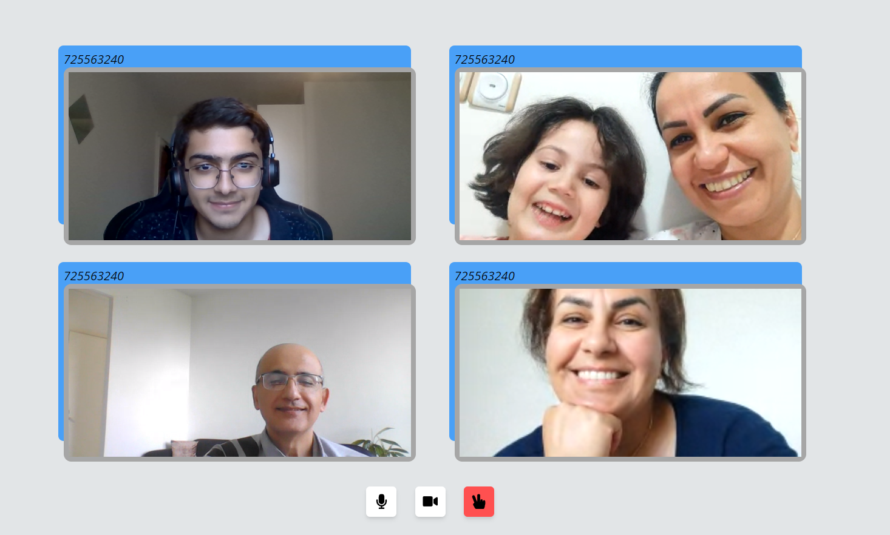
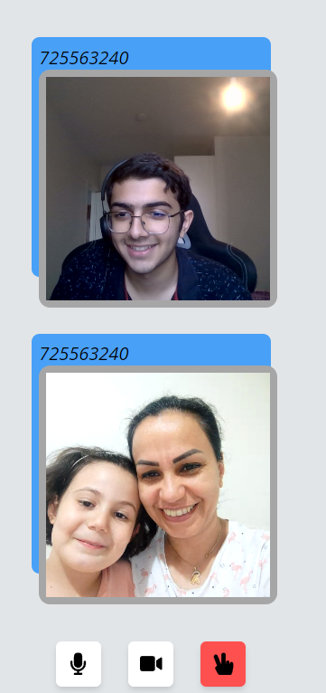

# This is a Video Call Website!


* PC/TV view

This is a video call app. You can mute/unmute, turn the camera on and off.Its responsive so you can use it in any monitor size. There is no limit for number of users. Currently to use it you have to run it in your local machine, but as soon as I can get a server and domain it will be available on internet, but for now to use it in your local machine you have to:
* Clone the project
* Go to https://www.agora.io/en/ and create an account.<br>
Agora's platform likely includes encoding and decoding mechanisms to facilitate real-time audio and video communication.<br>
Then you can get you App ID, Channel and Token in your agora panel. Copy them and paste them in 
```
# Go to this directory
# C:\Users\someo\source\repos\VideoCall\newapp\views.py

def getToken(request):
    appId = '' # Fill this
    appCertificate= '' # Paste the App ID also here

```
```
# Go to this directory
#C:\Users\someo\source\repos\VideoCall\static\scripts\videocall.js

# Fill these
const APP_ID = ''
const CHANNEL =  ''
const TOKEN = ''
```
* Install dependencies.
* Open command prompt in the manage.py file directory and Run the project with:
```
# Windows
python manage.py runserver 
```
* You can also talk to your friends by getting a public link from ngrok. To do this open a command prompt (not powershell) in 'ngrok.exe' directory and run the following commands. You may need to create ngrok account too.
```
ngrok http 8000
```
* Send the link to your friends and enjoy it.

<br>
Mobile veiw

#### It will be Available on internet soon with some improvements.
Thanks for reading!